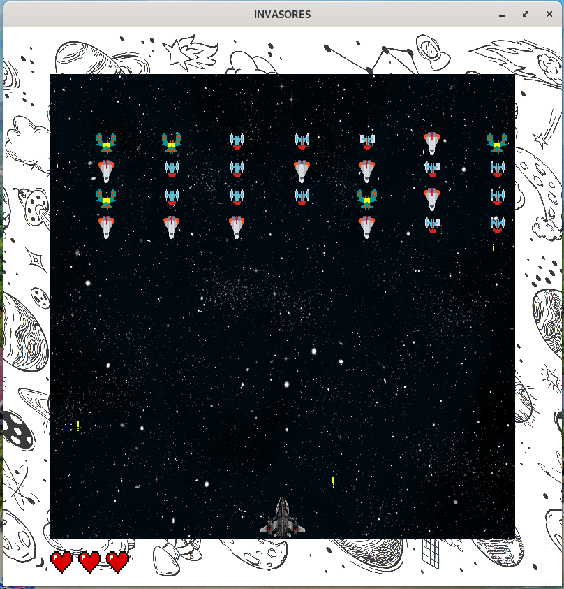
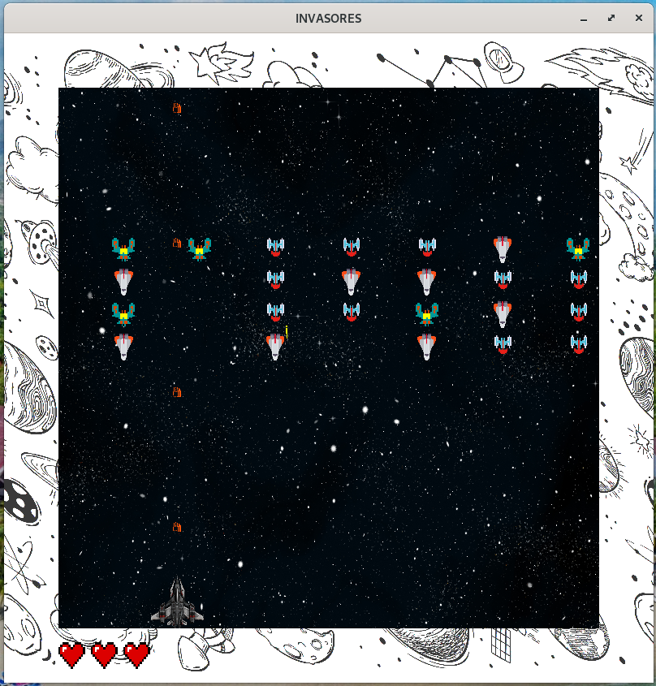
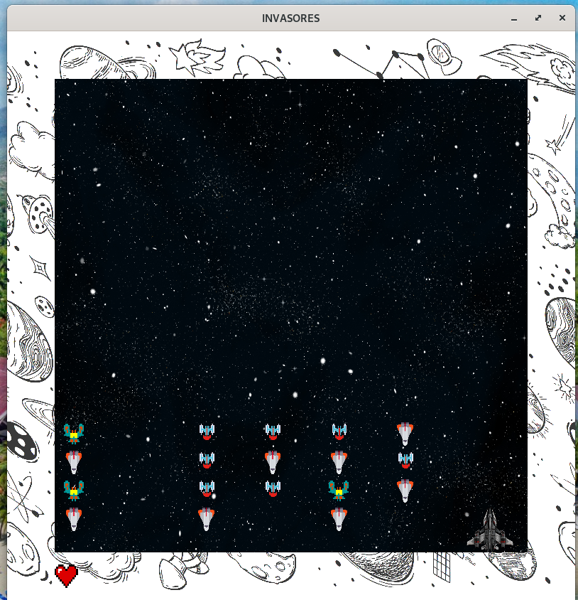

TP1 COMPUTAÇÃO GRÁFICA
======================

Esse trabalho foi desenvolvido no âmbito da disciplina Computação Gráfica 2021.1 pelos integrantes:
- Abdul Kevin Alexis
- Caio Vínicius

Bibliotecas necessárias
=======================================
glew, freeglut, SOIL, SDL, SDL_mixer
-------------------------------------

- Instalação freeglut:
>`sudo apt-get install freeglut3 freeglut3-dev`

- Instalação GLEW:
>`sudo apt-get install libglew-dev`

- Instalação SOIL:
>`sudo apt-get install libsoil-dev`

Instalação SDL e SDL_mixer:
>`sudo apt-get install libsdl1.2-dev libsdl-image1.2-dev libsdl-mixer1.2-dev libsdl-ttf2.0-dev`

Instruções para a compilação e execução
=======================================
1. Para compilar  jogo, deve  entrar no terminal. Dentro do diretorio,dá o comando *make*.
>**~/../tp1CompGraf$** `make`
2. Depois da compilação, roda o arquivo executável que foi criado fazendo 
>**~/../tp1CompGraf$** `./tp1compgraf`

*Atenção: No meu menu do jogo, encontra-se as intruções para jogar.*

Lista de itens adicionais implementados no jogo
===============================================

- Sons (até 12%): efeitos sonoros e música de fundo no seu jogo
- Telas (até 12%): splash screen, menu inicial, instruções, créditos, opções, game over, etc
- Vidas (5%): em vez de morrer na primeira colisão, o jogador pode ter vidas.

Screenshot da Cena
==================

Desmostração em Video
=====================

  
[Clique aqui para assistir o vídeo][6]

# Referência
- [Super Mario Bros Theme][1]
- [Efeitos sonores][2]
- [Naves][3]
- [Textura do Mundo][4]
- [Textura HUD][5]

[1]: <https://play.nintendo.com/documents/Super_Mario_Bros._medley.mp3.zip> (Super Mario Bros) 
[2]: <https://samples.mameworld.info/Older%20Samples.htm> (Efeitos)
[3]: <https://www.gratispng.com/png-ed4n8l/> (Naves)
[4]: <https://www.freepik.com/free-photo/starry-night-sky_7061153.htm#page=1&query=galaxy&position=11> (Galaxia)
[5]: <https://www.freepik.com/free-vector/space-doodle_10837997.htm#page=1&query=galaxy&position=24> (HUD)
[6]: <https://youtu.be/WQRROR7PRMQ> (Demostração)